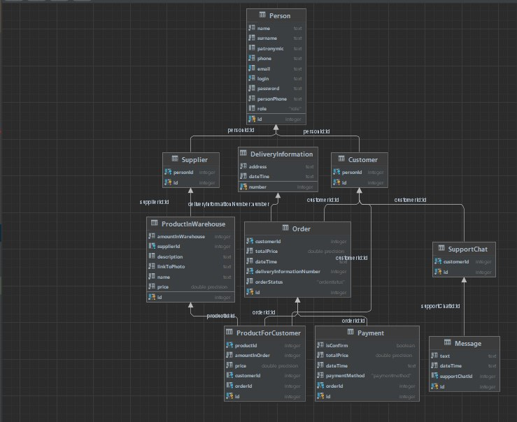

# Интернет-магазин SadFarmer
***
#### Основатель - Хряков Иван, группа М33031.
***
Проект по web'у, 5-6 семестр.
[Мой сайт](https://dolphin-in-river.onrender.com/)
***
**SadFarmer** - интернет-магазин по продаже **свежих** овощей и фруктов.
В нем вы **всегда** сможете увидеть приятные и не бьющие по кошельку цены,
сделать свой выбор в пользу того или иного фрукта или овоща и заказать доставку прямо до вашего дома.

Кроме того, что мы часто устраиваем распродажи, проводим интересные акции,
также ежедневно на сайте в специальной подборке "Ежедневные предложения" выкладываются товары с огромной скидкой! 
***
##### Диаграмма классов магазина SadFarmer

+ **Person** - абстрактная сущность, которая содержит информацию о пользователе, его данные для входа на сайт.

+ **Customer** - сущность, которая включает в себя информацию о клиенте онлайн-магазина.

+ **Supplier** - сущность, которая содержит информацию о поставщике.

+ **Order** - сущность, содержащая информацию о заказе, совершенным пользователем.

+ **Payment** - способ оплаты товаров через интернет или в очном формате. Содержит информацию общей стоимости, даты совершения покупки.

+ **SupportChat** - сущность, содержащая информацию, о сообщениях в чате поддержки.

+ **ProductForCustomer** - сущность, отображающая товар со стороны покупателя. 

+ **ProductInWarehouse** - сущность, отображающая товар на складе.

+ **Message** -  сущность, обозначающая текст письма и время его отправки.

+ **DeliveryInformation** - сущность, отвечающая за необходимые параметры для доставки